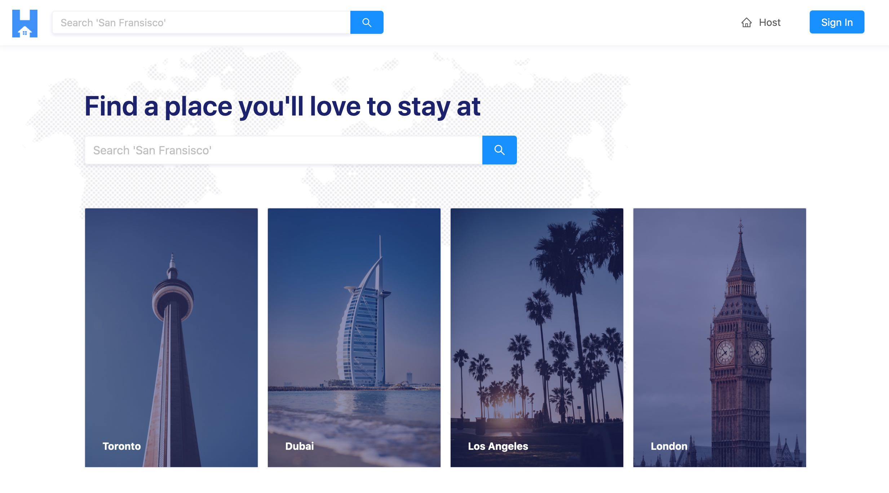

## Tiny House

This repository contains the code for the application developed in the **Tiny House** masterclass available at [newline.co](https://www.newline.co/tinyhouse).

For a live demo go to: https://www.tinyhouse.app/



### Server

The server side provides a **GraphQL** API implemented with **NodeJs**, **Express** and **Apollo**.

### Client

The client frontend application is built with **React**. It makes use of **React-Apollo** library to consume the API provided by the server, and presents the data to the user with the help of **Ant Design** for styling.

### Deployment

To prepare the application to be deployed to a production environment, use this bash script:

```./_script/build.sh```

### Tech Stack References

- [Typescript](https://www.typescriptlang.org/)
- [NodeJs](https://nodejs.org/en/)
- [Express](http://expressjs.com/)
- [Apollo Server](https://www.apollographql.com/docs/apollo-server/)
- [MongoDB Atlas](https://www.mongodb.com/cloud/atlas)
- [Google OAuth](https://developers.google.com/identity/protocols/oauth2)
- [Stripe](https://stripe.com/docs)
- [Cloudinary](https://cloudinary.com/documentation)

- [React](https://reactjs.org/)
- [React-Apollo](https://www.apollographql.com/docs/react/)
- [Ant Design](https://ant.design/)
