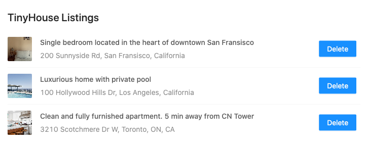

## Tiny House - Masterclass

This repository contains the code for the application developed in the **Tiny House** masterclass (Part 1) available at [newline.co](https://www.newline.co/tinyhouse).

### Server

The server side provides a simple **GraphQL** API implemented with **NodeJs**, **Express** and **Apollo**.

### Client

The client frontend application is built with **React**. It makes use of **React-Apollo** library to consume the API provided by the server, and presents the data to the user with the help of **Ant Design** for styling.

### Tech Stack References

- [Typescript](https://www.typescriptlang.org/)
- [NodeJs](https://nodejs.org/en/)
- [Express](http://expressjs.com/)
- [Apollo Server](https://www.apollographql.com/docs/apollo-server/)
- [MongoDB Atlas](https://www.mongodb.com/cloud/atlas)
- [React](https://reactjs.org/)
- [React-Apollo](https://www.apollographql.com/docs/react/)
- [Ant Design](https://ant.design/)
